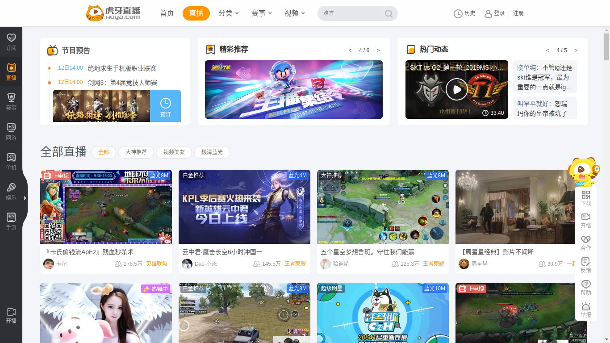
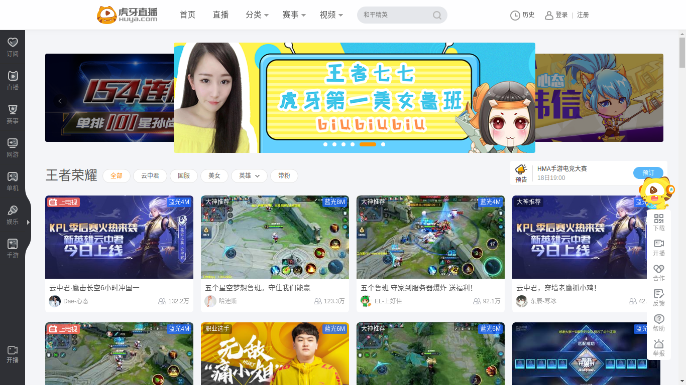
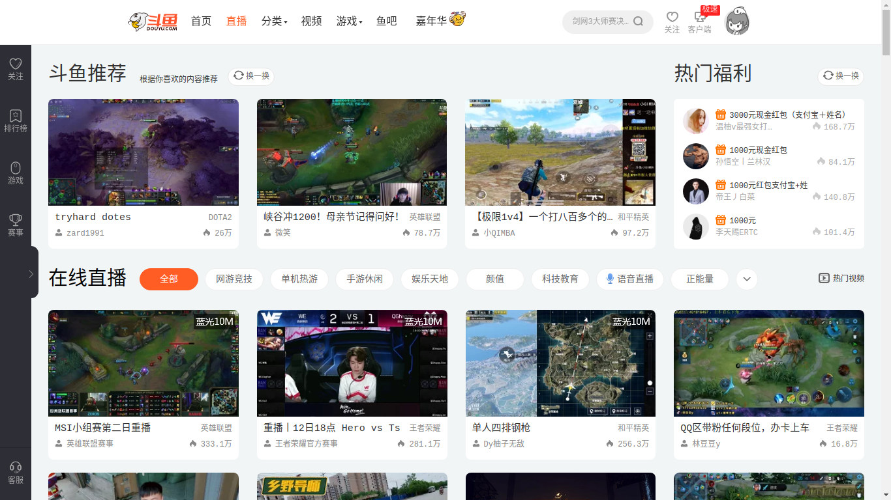
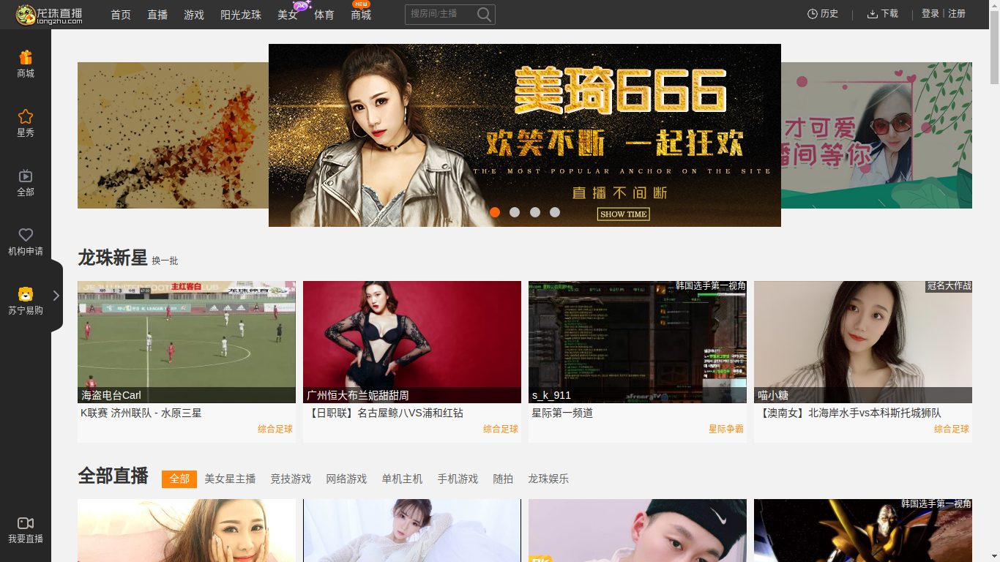
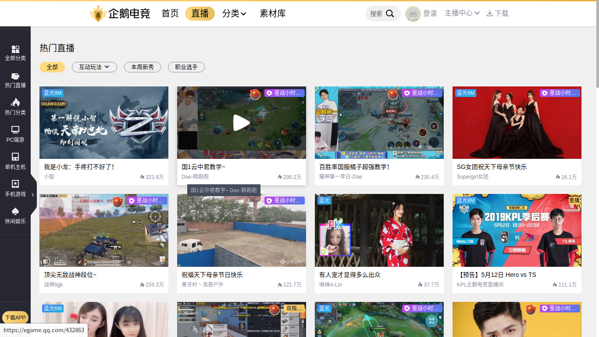
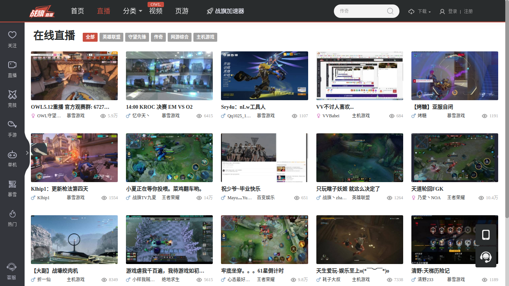

# 直播列表页设计

## 界面布局设计

观察了斗鱼、虎牙、龙珠、战旗、企鹅电竞的布局

可以看到，所有的直播平台都在顶部设置了几个大标签，其中首页、直播、分类三个标签就是直播平台的标配、因此在界面设计过程中这个是必不可少的，但是考虑到是客户端的实现，在顶部放这么多个大标签也不见得是合适的。

必备标签：

1. 首页
2. 直播
3. 分类
4. 搜索框
5. LOGO
6. 用户信息、登录

参考了虎牙和斗鱼的客户端，都不会把导航放在顶部而是放在侧边栏中

## 侧边栏设计

除了顶部的导航栏，侧边栏基本都是清一色的快捷入口，主要的按钮类别一般是：

1. 首页
2. 我的订阅
3. 推荐分类（LOL、秀场、手游等）
4. 赛事

这几个分类都是非常常用的，放在侧边栏非常合理

不仅如此，所有的侧边栏都有一个打开和收起按钮，避免占用过多的空间，保留更多空间给直播列表内容

但是，在侧边栏弹出时列表布局的设计就各有不同了（以下均为屏幕尺寸大于1200，小于1200几乎都会出现滚动条不予讨论）

  - 斗鱼：小屏幕下直接显示侧边栏，列表宽度不变，总宽度超过屏幕导致出现滚动条，大屏幕下正常
  - 虎牙：显示侧边栏但列表仅占用剩余空间，列表由4列变3列，在屏幕宽度不足的情况下与斗鱼相同
  - 企鹅电竞：无论侧边栏是打开或关闭，右边列表都保证能够完整显示为至少3列以上
  - 战旗、龙珠：与企鹅电竞相同

单从效果上看，企鹅、龙珠、战旗的效果最好，虎牙次之，但是在拖动窗口大小测试性能中发现

- 战旗：性能最差，能够感受到明显的卡顿（因为直接对多个元素上的宽度进行赋值而且有过渡效果，严重回流）
- 企鹅、虎牙：适中
- 斗鱼的性能最好（但是感觉完全没有考虑1300以下的屏幕。。。）

总结一下，列表布局需要考虑的内容：

1. 不同屏幕宽度下必须要保证不出现横向滚动条（不考虑1200以下的屏幕）
2. 侧边栏展开时不能出现滚动条
3. 在列表空间大小不同时选择合适的列数布局，最少要能够对侧边栏的展开和屏幕大小尺寸变化响应
4. 合理使用动画等，保证性能

## 列表内容设计

**推荐模块**

像虎牙和斗鱼都有在直播列表的顶部加上一些推荐的模块，这一块还是是挺重要的，对于不知道看什么的观众有一定的导流作用

但是不知道为什么战旗和企鹅电竞的列表都没有推荐模块，而龙珠直播推送了一堆莫名其妙的直播还不如不推（在 AABB 离开和DNF板块集体出走后感觉就只留下了秀场直播）

相比其他直播，虎牙直播的列表更加合理，在所有直播的列表中推荐职业比赛、资讯推文、热门动态，在分类的直播列表中推荐该分类下的热门主播

**标签筛选**

除开推荐外，所有平台的列表页都会有一组推荐分类或者推荐标签，这个上面斗鱼虎牙是做的最好的，为直播都打上了标签，能够直接索引出来（比如筛选某一个英雄的直播，这个在WZRY或者LOL出新英雄的时候特别有用）

**直播项信息**

各个平台有自己的设计,先从多个方面对单个直播项的信息进行梳理

从信息设置来看,大家几乎都是一样的

- 一张预览图或者海报
- 房间名
- 人气
- 主播信息(名字、头像)
- 所属分类
- 直播的一些标签（王者大神、职业选手、蓝光8M、热舞、上电视等）

有趣的是在封面图的选择上，游戏多数都是实时的游戏截图，少数主播会获得由官方制作的海报，但是秀场区的主播全都是自己的P图照，估计是怕大家看到了实时画面就没兴趣进去而是去找那些在跳舞唱歌的房间了吧（哈哈哈，就是这么真实）

## 部分截图

